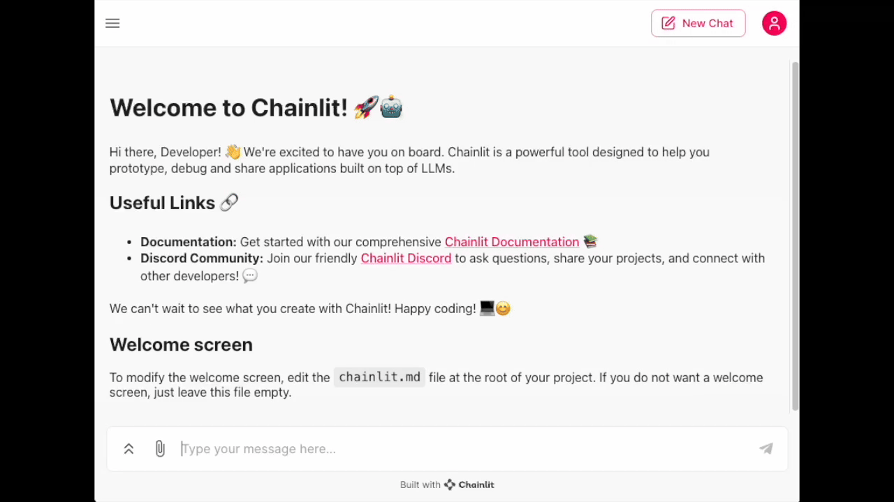

# Building AI Chatbot from Scratch
Let's build a local chatbot with Orca-mini and Llama2 using low-level prompting.

## Resources
* [Presentation Slides](https://docs.google.com/presentation/d/15QF9dAfK-6snUfSOsoU5ksjj5p4ouQ7QH71sf2wljj4/edit?usp=sharing)
* [Hugging Face](https://huggingface.co/)
* [Orca-mini Release Post](https://www.reddit.com/r/LocalLLaMA/comments/14ibzau/orcamini13b_orcamini7b_orcamini3b/?rdt=34106)
* [CTransformers](https://github.com/marella/ctransformers)
* [orca-mini 3B Model Card](https://huggingface.co/zoltanctoth/orca_mini_3B-GGUF)
* [The WizardLM Dataset](https://huggingface.co/datasets/pankajmathur/WizardLM_Orca)
* [Streamlit](https://streamlit.io/)
* [Chainlit](https://docs.chainlit.io/get-started/overview)

## A tool for building more sophisticated chatbots
* [LangChain](https://www.langchain.com/)

# Let's connect!
https://www.linkedin.com/in/zoltanctoth/
